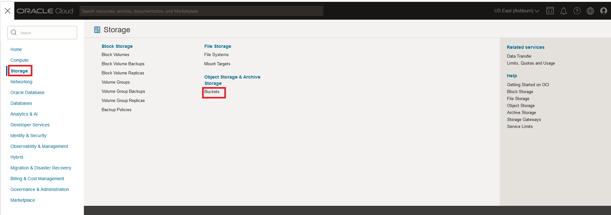
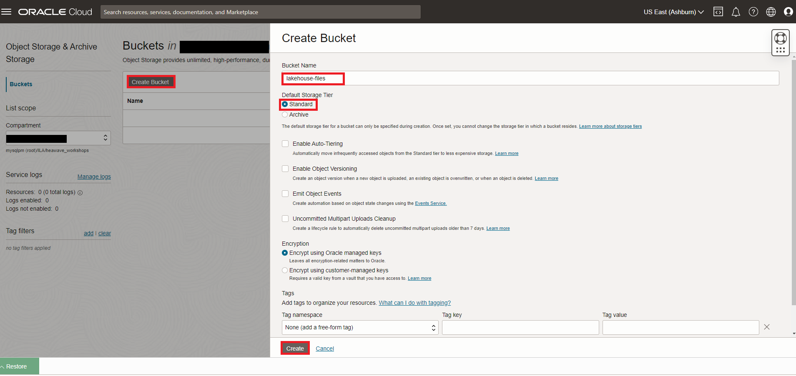
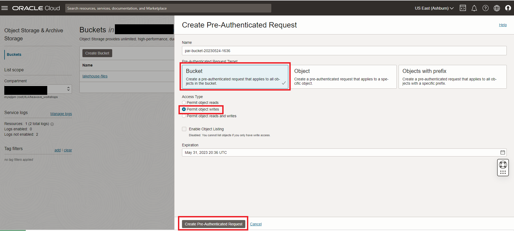
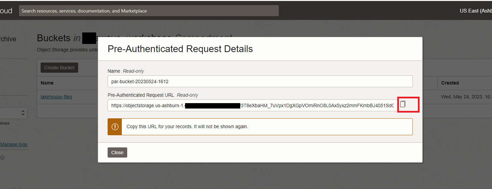
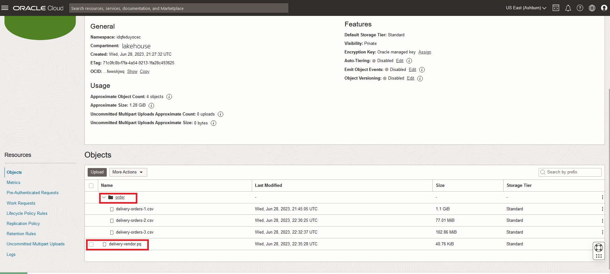

# Upload data to Object Storage for HeatWave Lakehouse

## Introduction

A set of files have been created for you to use in this workshop. You will create an object storage bucket and upload the files to it.

### Objectives

- Download and unzip  Sample files
- Create Object Storage bucket
- Add files into  the Bucket using the saved PAR URL

### Prerequisites

- An Oracle Trial or Paid Cloud Account
- Some Experience with MySQL Shell
- Completed Lab 5

## Task 1: Download and unzip  Sample files

1. If not already connected with SSH, on Command Line, connect to the Compute instance using SSH ... be sure replace the  "private key file"  and the "new compute instance ip"

     ```bash
    <copy>ssh -i private_key_file opc@new_compute_instance_ip</copy>
     ```

2. Setup folder to house imported sample data

    a. Create folder

    ```bash
    <copy>mkdir lakehouse</copy>
     ```

    b. Go into folder

    ```bash
    <copy>cd lakehouse</copy>
     ```

3. Download sample files

    ```bash
    <copy>wget https://objectstorage.us-ashburn-1.oraclecloud.com/p/nnsIBVX1qztFmyAuwYIsZT2p7Z-tWBcuP9xqPCdND5LzRDIyBHYqv_8a26Z38Kqq/n/mysqlpm/b/plf_mysql_customer_orders/o/lakehouse/lakehouse-order.zip</copy>
     ```

4. Unzip lakehouse-order.zip file which will generate folder datafiles with 4 files

    ```bash
    <copy>unzip lakehouse-order.zip</copy>
     ```

5. Go into the lakehouse/datafiles folder and list all of the files

    ```bash
    <copy>cd ~/lakehouse/datafiles</copy>
    ```

    ```bash
    <copy>ls -l</copy>
    ```

    

## Task 2: Create Object Storage bucket

1. From the Console navigation menu, click **Storage**.
2. Under Object Storage, click Buckets
    

    **NOTE:** Ensure the correct Compartment is selected : Select **lakehouse**

3. Click Create Bucket. The Create Bucket pane is displayed.

    

4. Enter the Bucket Name **lakehouse-files**
5. Under Default Storage Tier, click Standard. Leave all the other fields at their default values.

    

6. Create the  Pre-Authenticated Request URL for the bucket
     - a. Click on the 3 dots to the right of the **lakehouse-files** bucket  Click on ‘Create Pre-Authenticated Request’
        
        
     - b. The ‘Bucket’ option will be pre-selected
     - c. For 'Access Type' select 'Permit object write
     - d. Click the Create "Pre-Authenticated Request' button
        
     - e. Click the ‘Copy’ icon to copy the PAR URL
        
     - f. Save the generated PAR URL; you will need it in the next task

## Task 3: Add files into  the Bucket using the saved PAR URL

1. Go into the lakehouse/datafiles folder and list all of the files

    ```bash
    <copy>cd ~/lakehouse/datafiles</copy>
    ```

    ```bash
    <copy>ls -l</copy>
    ```

    

2. Add the delivery-orders-1.csv file to the storage bucket by modifying the following statement with the example below. You must replace the **(PAR URL)** value with the saved generated **PAR URL** from the previous Task.

    ```bash
    <copy>curl -X PUT --data-binary '@delivery-orders-1.csv' (PAR URL)order/delivery-orders-1.csv</copy>
     ```

     **Example**  
     curl -X PUT --data-binary '@delivery-orders-1.csv' https://objectstorage.us-ashburn-1.oraclecloud.com/p/RfXc55AGpLSu26UgqbmGxbWZwh4hPhLkVWYMg4f5pNerQx_1NghgSKJHLzE4IWxH/n/******/b/lakehouse-files/o/order/delivery-orders-1.csv

3. Add the @delivery-orders-2.csv file to the storage bucket by modifying the following statement with the example below. You must replace the **(PAR URL)** value with the saved generated **PAR URL** from the previous Task.

    ```bash
    <copy>curl -X PUT --data-binary '@delivery-orders-2.csv' (PAR URL)order/delivery-orders-2.csv</copy>
     ```

     **Example**  
     curl -X PUT --data-binary '@delivery-orders-2.csv' https://objectstorage.us-ashburn-1.oraclecloud.com/p/RfXc55AGpLSu26UgqbmGxbWZwh4hPhLkVWYMg4f5pNerQx_1NghgSKJHLzE4IWxH/n/******/b/lakehouse-files/o/order/delivery-orders-2.csv

4. Add the @delivery-orders-31.csv file to the storage bucket by modifying the following statement with the example below. You must replace the **(PAR URL)** value with the saved generated **PAR URL** from the previous Task.

    ```bash
    <copy>curl -X PUT --data-binary '@delivery-orders-3.csv' (PAR URL)order/delivery-orders-3.csv</copy>
     ```

     **Example**  
     curl -X PUT --data-binary '@delivery-orders-3.csv' https://objectstorage.us-ashburn-1.oraclecloud.com/p/RfXc55AGpLSu26UgqbmGxbWZwh4hPhLkVWYMg4f5pNerQx_1NghgSKJHLzE4IWxH/n/******/b/lakehouse-files/o/order/delivery-orders-3.csv

5. Add the @delivery-vendor.pq file to the storage bucket by modifying the following statement with the example below. You must replace the **(PAR URL)** value with the saved generated **PAR URL** from the previous Task.

    ```bash
    <copy>curl -X PUT --data-binary '@delivery-vendor.pq' (PAR URL)delivery-vendor.pq</copy>
     ```

     **Example**  
     curl -X PUT --data-binary '@delivery-vendor.pq' https://objectstorage.us-ashburn-1.oraclecloud.com/p/RfXc55AGpLSu26UgqbmGxbWZwh4hPhLkVWYMg4f5pNerQx_1NghgSKJHLzE4IWxH/n/******/b/lakehouse-files/o/delivery-vendor.pq

6. Your **lakehouse-files** bucket should look like this:
    

You may now **proceed to the next lab**

## Acknowledgements

- **Author** - Perside Foster, MySQL Solution Engineering

- **Contributors** - Abhinav Agarwal, Senior Principal Product Manager, Nick Mader, MySQL Global Channel Enablement & Strategy Manager
- **Last Updated By/Date** - Perside Foster, MySQL Solution Engineering, May 2023
