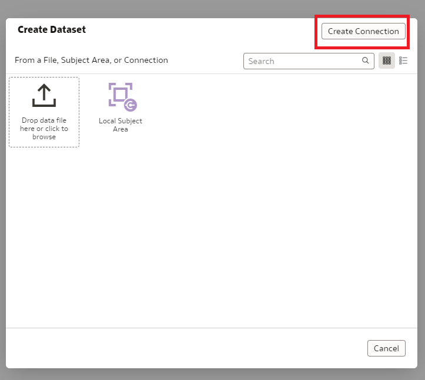
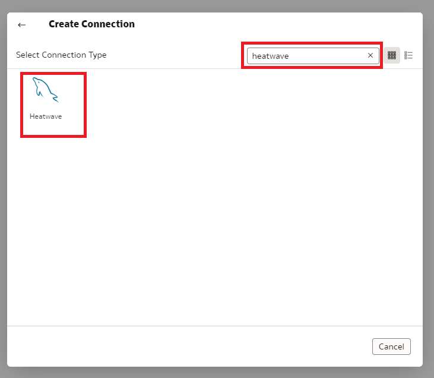
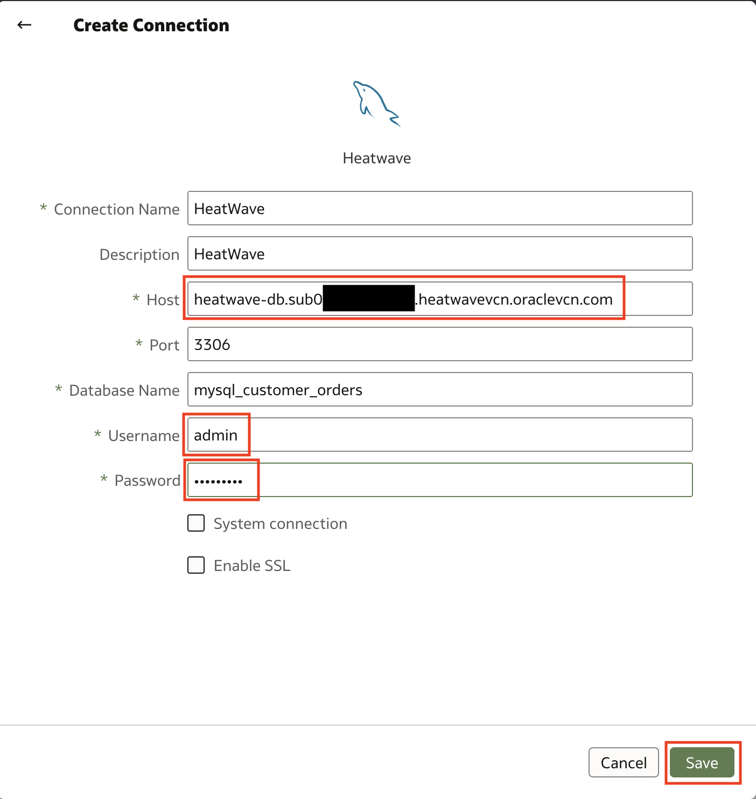
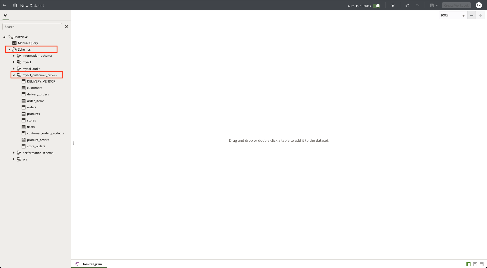
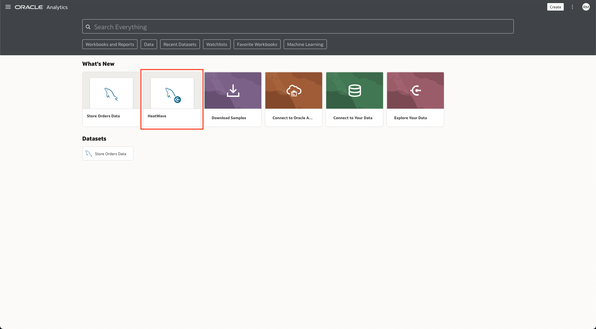
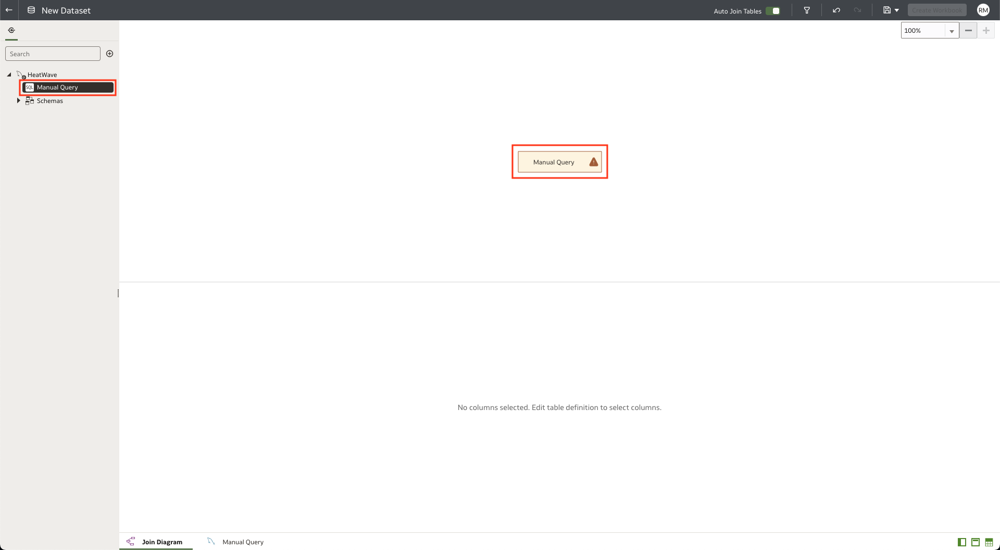
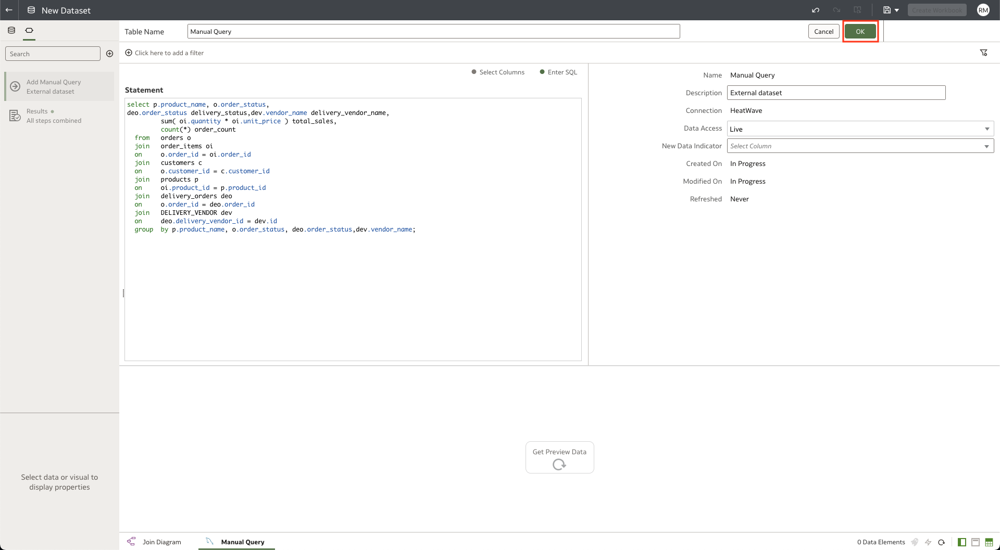
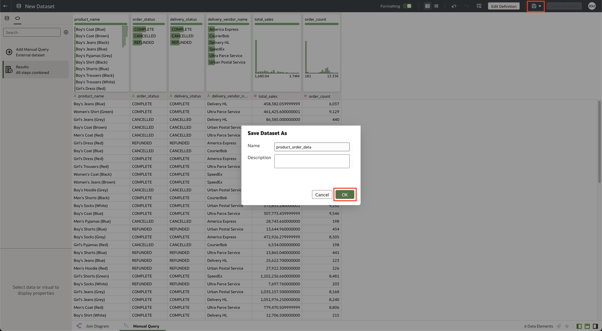

# Create Datasets in Oracle Analytics Cloud with MySQL HeatWave


## Introduction

MySQL HeatWave can easily be used for development tasks with existing Oracle services, such as Oracle Cloud Analytics. -> Oracle Analytics Cloud (OAC) provides the industry’s most comprehensive cloud analytics in a single unified platform, including self-service visualization and inline data preparation to enterprise reporting, advanced analytics, and self-learning analytics that deliver proactive insights.

Use MySQL HeatWave with OAC to explore and perform collaborative analytics with your MySQL data.

_Estimated Time:_ 10 minutes


### Objectives

In this lab, you will be guided through the following tasks:

- Create a dataset on OAC using the store_orders table
- Create a dataset on OAC using the delivery\_orders and DELIVERY\_VENDORS tables

### Prerequisites

- An Oracle Trial or Paid Cloud Account
- Some Experience with MySQL Shell
- Completed Lab 8

## Task 1: Create Connection from HeatWave DB to OAC

1. Navigate to Menu > Analytics > Analytics Clouds

2. Select the OAC instance you provisioned to access the OAC console by clicking on Analytics Home Page. Click on the **Analytics Home Page** button.
    

3. Create a Connection to HeatWave to build a dashboard
    

4. Click the **Create Connection** button
    

5. Search for HeatWave and select HeatWave as the database.
    

6. Specify the connections details
    - Specify the hostname of heatwave-db
    - Use the FQDN information you save in Step 3
    - Port: 3306
    - Database Name: mysql\_customer\_orders
    - Be sure to use the Heatwave DB username and password

    Hit the **Save** button to fisnish creating the connection.
    

7. The completed connection will display a "New Dataset" page. Click on the **Schemas** link and select the **mysql\_customer\_orders** schema
    

## Task 2: Create a dataset using the store orders table

1. Drag and drop the **store\_orders** table from the sidebar into the **New Dataset** page.
    

2. Save the dataset as **store\_orders\_data**.

## Task 3: Create a dataset using a manual query

1. From the Oracle Analytics Cloud Homepage, click on the **HeatWave** Connection we created earlier in the lab.
    

2. Double click on **Manual Query** in the sidebar on the left and then click on the orange box in the middle of the screen to edit the query. 
    

3. Enter the query shown below into the **Statement** text box and click the **OK** button in the top right of the screen.
    ```bash
    <copy>select p.product_name, o.order_status,
deo.order_status delivery_status,dev.vendor_name delivery_vendor_name,
         sum( oi.quantity * oi.unit_price ) total_sales,
         count(*) order_count
  from   orders o
  join   order_items oi
  on     o.order_id = oi.order_id
  join   customers c
  on     o.customer_id = c.customer_id
  join   products p
  on     oi.product_id = p.product_id
  join   delivery_orders deo
  on     o.order_id = deo.order_id
  join   DELIVERY_VENDOR dev
  on     deo.delivery_vendor_id = dev.id
  group  by p.product_name, o.order_status, deo.order_status,dev.vendor_name;</copy>
     ```

    

4. Click on the **Save** button in the top right corner, enter **product\_order\_data** as the name of the dataset and click **OK**.
    

**Congratulations! You have successfully finished this Lab. Please proceed to the next lab.**


## Acknowledgements

- **Author** - Runit Malik, MySQL Cloud Solution Engineer
- **Contributors** - Perside Foster, MySQL Principal Solution Engineer
- **Last Updated By/Date** - Runit Malik, MySQL Cloud Solution Engineer, September 2023