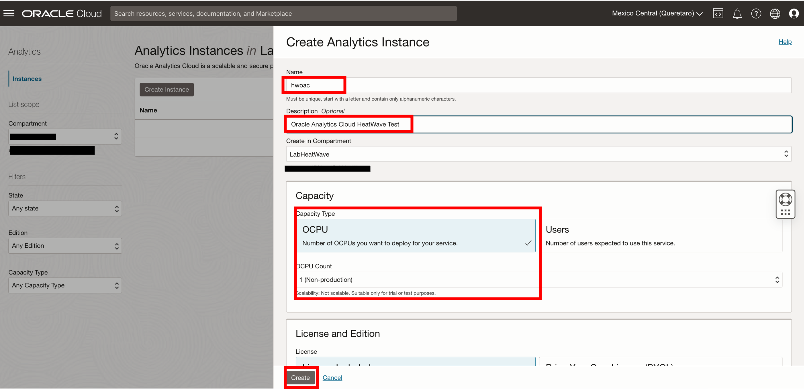

# Create an Oracle Analytics Cloud Instance


## Introduction

MySQL HeatWave can easily be used for development tasks with existing Oracle services, such as Oracle Cloud Analytics. -> Oracle Analytics Cloud (OAC) provides the industry’s most comprehensive cloud analytics in a single unified platform, including self-service visualization and inline data preparation to enterprise reporting, advanced analytics, and self-learning analytics that deliver proactive insights.

Use MySQL HeatWave with OAC to explore and perform collaborative analytics with your MySQL data.

_Estimated Time:_ 20 minutes


### Objectives

In this lab, you will be guided through the following tasks:

- Create an Oracle Analytics Cloud instance and connect to MySQL HeatWave

### Prerequisites

- An Oracle Trial or Paid Cloud Account
- Some Experience with MySQL Shell
- Completed Lab 4

## Task 1: Create an Oracle Analytics Cloud Instance

1. From the OCI Console, nagivate to Analytics & AI > Analytics Cloud
    

2. Select the **lakehouse** Compartment and Click the **Create Instance** button
    
    
3. On the Create Analytics Instance enter the required information as shown below

    Name:
     ```bash
    <copy>hwoac</copy>
     ```

    Description:
    ```bash
    <copy>Oracle Analytics Cloud HeatWave Test</copy>
     ```

    Capacity: Select **OCPU** and select **1**

    License and Edition:
        - Select **License Included**
        - Select **Enterprise Edition**

4. Click the **Create** button
    

5. It takes about 12-15 minutes for the OAC instance creation to complete
    

## Task 2: Configure Private Access Channel

1. Go down to the “Private Access Channel” resources page and click on the **Configure Private Access Channel** button.

2. Click the **Create Private Access Channel** button

3. On the create Private Access Channel page enter the following:

    Name:
    ```bash
    <copy>hwoacpac</copy>
     ```

     DNS Zones: **Check Virtual Cloud Network's domain name as DNS zone (hwvcn.oraclevcn.com)**

    Description:
    ```bash
    <copy>Testing</copy>
     ```

     **Remove second DNS Zone entry**
    

4. Click the **Configure** button

5. Wait 15 minutes for the configuration process to complete before proceeding to Task 3.
    

## Task 3: Get HeatWave DB Hostname

1. Before we start, go to Menu > Databases > DB Systems

2. Select HeatWave database: **heatwave-db**

3. Click on the "Connections" tab on the Endpoints > Internal FQDN > Click on the Copy link.
    

4. Save the Hostname in your notepad for use with OAC in a later lab.
    Example: **hwdb.sub09012...hwvcn.oraclevcn.com**

**Congratulations! You have successfully finished this Lab. Please proceed to the next lab.**


## Acknowledgements

- **Author** - Runit Malik, MySQL Cloud Solution Engineer
- **Contributors** - Perside Foster, MySQL Principal Solution Engineer
- **Last Updated By/Date** - Runit Malik, MySQL Cloud Solution Engineer, September 2023