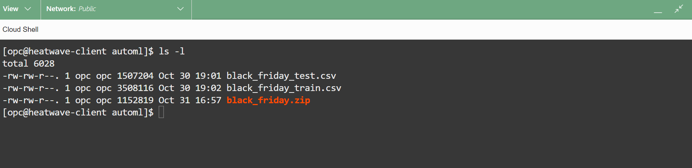
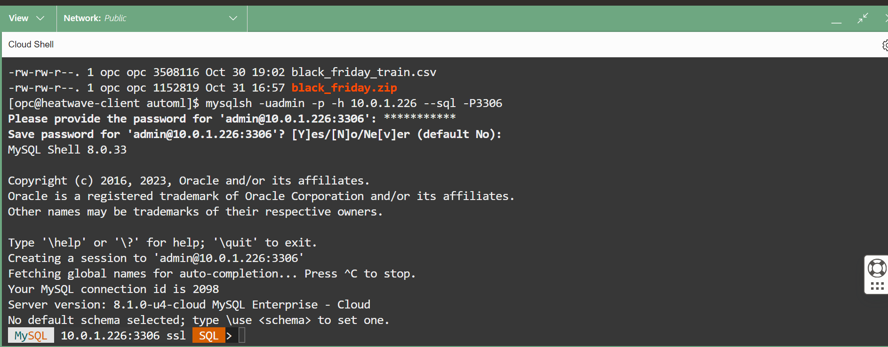

# Build HeatWave ML with SQL


## Introduction

HeatWave ML makes it easy to use machine learning, whether you are a novice user or an experienced ML practitioner. You provide the data, and HeatWave AutoML analyzes the characteristics of the data and creates an optimized machine learning model that you can use to generate predictions and explanations. An ML model makes predictions by identifying patterns in your data and applying those patterns to unseen data. HeatWave ML explanations help you understand how predictions are made, such as which features of a dataset contribute most to a prediction.

To load the black_friday data components, perform the following steps to create and load the required schema and tables. The requirements for Python 3 are already loaded in the compute instance and you have already installed MySQL Shell in the previous Lab.

After this step the data is stored in the MySQL HeatWave database in the following schema and tables:

**heatwaveml\_bench schema:** The schema containing training and test dataset tables.

**black\_friday\_train table:** The training dataset. Includes feature columns (Gender,Age,Occupation,City\_Category,Stay\_In\_Current\_City\_Years,Marital\_Status,Product\_Category\_1,Product\_Category\_2,Product\_Category\_3,Purchase).

**black\_friday\_test table:** The test dataset (unlabeled). Includes feature columns (Gender,Age,Occupation,City\_Category,Stay\_In\_Current\_City\_Years,Marital\_Status,Product\_Category\_1,Product\_Category\_2,Product\_Category\_3,Purchase).

_Estimated Time:_ 10 minutes

### Objectives

In this lab, you will be guided through the following task:

- Download and unzip blac_friday files
- Create ML Data
- Train the machine learning model
- Predict and Explain using the test table
- Score your machine learning model to assess its reliability and unload the model


### Prerequisites

- An Oracle Trial or Paid Cloud Account
- Some Experience with MySQL Shell
- Completed Lab 3

## Task 1: Download and unzip  Sample files

1. If not already connected with SSH, on Command Line, connect to the Compute instance using SSH ... be sure replace the  "private key file"  and the "new compute instance ip"

     ```bash
    <copy>ssh -i private_key_file opc@new_compute_instance_ip</copy>
     ```

2. Setup folder to house imported sample data

    a. Create folder

    ```bash
    <copy>mkdir automl</copy>
     ```

    b. Go into folder

    ```bash
    <copy>cd automl</copy>
     ```

3. Download sample files

    ```bash
    <copy>wget https://objectstorage.us-ashburn-1.oraclecloud.com/p/Ukv1g5qyvJK6asGvVoksGkUDIu8KaoVfmbhBzpmbRahXu7a2EmaVTJev2a-lHvUa/n/mysqlpm/b/mysql_customer_orders/o/black_friday.zip</copy>
     ```

4. Unzip black_friday.zip file which will generate 2 files

    ```bash
    <copy>unzip black_friday.zip</copy>
     ```

5. List all of the files

    ```bash
    <copy>ls -l</copy>
    ```

    

## Task 2: Create ML Data

1. If not already connected to MySQL then connect to MySQL using the MySQL Shell client tool with the following command:

    ```bash
    <copy>mysqlsh -uadmin -p -h 10.0.1... --sql -P3306</copy>
    ```

    
2. To Create the Machine Learning schema and tables on the MySQL HeatWave DB System perform the following steps :

    a. Create the ML database :

    ```bash
    <copy>CREATE DATABASE heatwaveml_bench;</copy>
    ```

    b. Set new database as default :

    ```bash
    <copy>USE heatwaveml_bench;</copy>
    ```

    c. Create train table :

    ```bash
    <copy>CREATE TABLE black_friday_train (Gender VARCHAR(255), Age VARCHAR(255), Occupation VARCHAR(255), City_Category VARCHAR(255), Stay_In_Current_City_Years VARCHAR(255), Marital_Status VARCHAR(255), Product_Category_1 VARCHAR(255), Product_Category_2 VARCHAR(255), Product_Category_3 VARCHAR(255), Purchase FLOAT);</copy>
    ```

    d. Create test table :

    ```bash
    <copy>CREATE TABLE black_friday_test LIKE black_friday_train;</copy>
    ```

    e. Load train table

    ```bash
    <copy>\js</copy>
    ```

    ```bash
    <copy>util.importTable("black_friday_train.csv",{table: "black_friday_train", dialect: "csv-unix", skipRows:1})</copy>
    ```

    f. Load test table

    ```bash
    <copy>util.importTable("black_friday_test.csv",{table: "black_friday_test", dialect: "csv-unix", skipRows:1})</copy>
    ```

    ```bash
    <copy>\sql</copy>
    ```

3. View the content of  your machine Learning schema (ml_data)

    ```bash
    <copy>show tables; </copy>
    ```

## Task 3: Train the machine learning model

1. Train the model using ML_TRAIN. Since this is a classification dataset, the classification task is specified to create a classification model:

    ```bash
    <copy>CALL sys.ML_TRAIN('heatwaveml_bench.black_friday_train', 'Purchase', JSON_OBJECT('task', 'regression'), @model_black_friday);</copy>
    ```

2. When the training operation finishes, the model handle is assigned to the @model_black_friday session variable, and the model is stored in your model catalog. You can view the entry in your model catalog using the following query, where user1 is your MySQL account name:

    ```bash
    <copy>SELECT model_id, model_handle, train_table_name FROM ML_SCHEMA_admin.MODEL_CATALOG;</copy>
    ```

3. Load the model into HeatWave ML using ML\_MODEL\_LOAD routine:

    a.  Reset model handle variable

    ```bash
    <copy>SET @model_black_friday = (SELECT model_handle FROM ML_SCHEMA_admin.MODEL_CATALOG   ORDER BY model_id DESC LIMIT 1); </copy>
    ```

    b. A model must be loaded before you can use it. The model remains loaded until you unload it or the HeatWave Cluster is restarted.

    ```bash
    <copy>CALL sys.ML_MODEL_LOAD(@model_black_friday, NULL);</copy>
    ```

## Task 4: Predict and Explain for test table

1. Make a prediction for the test table  data using the ML\_PREDICT\_ROW routine.

    ```bash
    <copy>CALL sys.ML_PREDICT_TABLE('heatwaveml_bench.black_friday_test', @model_black_friday,'heatwaveml_bench.black_predictions',NULL);</copy>
    ```

2. To retrieve the some of the predictions

    ```bash
    <copy>SELECT * FROM heatwaveml_bench.black_predictions limit 5\G</copy>
    ```

3. Generate an explanation for the same row of data using the ML\_EXPLAIN\_ROW routine to understand how the prediction was made:

    ```bash
    <copy> CALL sys.ML_EXPLAIN_TABLE('heatwaveml_bench.black_friday_test', @model_black_friday, 'heatwaveml_bench.black_explanations', JSON_OBJECT('prediction_explainer', 'permutation_importance'));</copy>
    ```

4. To retrieve the some of the expalnations

    ```bash
    <copy>SELECT * FROM heatwaveml_bench.black_explanations limit 5\G</copy>
    ```

## Task 5: Score your machine learning model to assess its reliability and unload the model

1. Score the model using ML\_SCORE to assess the model's reliability. This example uses the accuracy metric, which is one of the many scoring metrics supported by HeatWave ML.

    ```bash
    <copy> CALL sys.ML_SCORE('heatwaveml_bench.black_friday_test', 'Purchase', @model_black_friday, 'r2', @score_black_friday, null);</copy>
    ```

2. To retrieve the computed score, query the @score session variable

    ```bash
    <copy>SELECT @score_black_friday;</copy>
    ```

3. Unload the model using ML\_MODEL\_UNLOAD:

    ```bash
    <copy>CALL sys.ML_MODEL_UNLOAD(@model_black_friday);</copy>
    ```

    To avoid consuming too much space, it is good practice to unload a model when you are finished using it.

You may now **proceed to the next lab**

## Learn More

- [Oracle Cloud Infrastructure MySQL Database Service Documentation ](https://docs.cloud.oracle.com/en-us/iaas/MySQL-database)
- [MySQL HeatWave ML Documentation] (https://dev.mysql.com/doc/heatwave/en/heatwave-machine-learning.html)

## Acknowledgements

- **Author** - Perside Foster, MySQL Solution Engineering

- **Contributors** - Salil Pradhan, Principal Product Manager,
Nick Mader, MySQL Global Channel Enablement & Strategy Manager
- **Last Updated By/Date** - Perside Foster, MySQL Solution Engineering, October 2023
