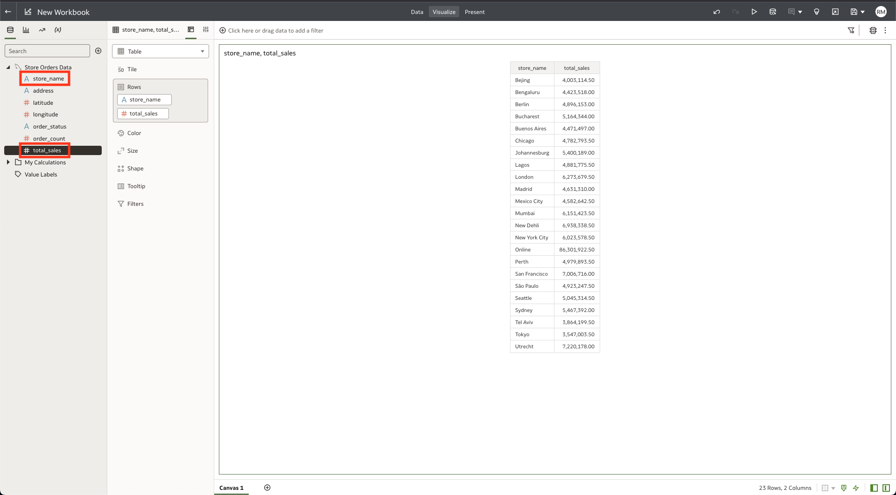
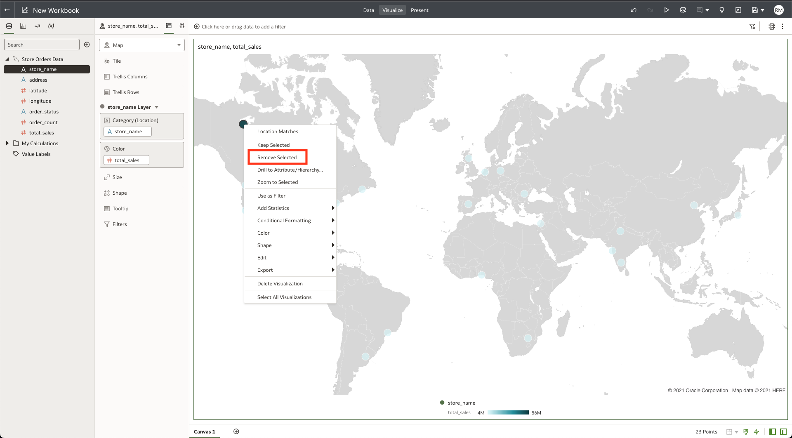

# Build a real-time dashboard in Oracle Analytics Cloud with MySQL HeatWave

## Introduction

MySQL HeatWave can easily be used for development tasks with existing Oracle services, such as Oracle Cloud Analytics. -> Oracle Analytics Cloud (OAC) provides the industry’s most comprehensive cloud analytics in a single unified platform, including self-service visualization and inline data preparation to enterprise reporting, advanced analytics, and self-learning analytics that deliver proactive insights.

Use MySQL HeatWave with OAC to explore and perform collaborative analytics with your MySQL data.

_Estimated Time:_ 15 minutes

### Objectives

In this lab, you will be guided through the following tasks:

- Create a heatmap on OAC using the store\_orders\_data dataset
- Create a sunburst chart on OAC using the product\_order\_data dataset

### Prerequisites

- An Oracle Trial or Paid Cloud Account
- Some Experience with MySQL Shell
- Completed Lab 5 and Lab 9

## Task 1: Use OAC to Analyze the store_orders Dataset

1. From the Oracle Analytics Cloud Homepage, select the store\_order\_data dataset we created in the previous lab.

2. Drag and drop **store\_name** and **total\_sales** into the visualization area. We are only interested in these values as we will be creating a heatmap to visualize total sales by store location. 
    

3. Click on the **Pick Visualization** button and select the **Map** visualization.
    

4. Ensure that **store\_name** is under the **Category (Location)** header and **total\_sales** is under the **Color** header.
    

5. We want to exclude Online orders from the heatmap of store orders. In the map visualization, select the **Online** bubble, right click on the bubble and click **Remove Selected**.
    

Your final visualization should look like this: 
    

6. Save the workbook as "store\_total\_sales".

7. Let's review our map and determine how it can be used to aggregate total sales by country or by region. 

## Task 2: Use OAC to Analyze the product_order Dataset

1. From the Oracle Analytics Cloud Homepage, select the product\_order\_data dataset we created in the previous lab.

2. Click on the **product\_name** and **total\_sales** columns and right click. Select the **Create Best Visualization** button. OAC should select the Bar Graph visualization as the best fit for the data selected.
    

3. We are now going to create a second visualization for our dashboard. Click on the **delivery\_status**, **delivery\_vendor\_name** and **order\_count** columns. Right click and select **Pick Visualization**. 
    

4. From the list of visualizations, select the **Sunburst** option.
    

5. Ensure that **order\_count** is under the **Values (Slice Size)** header, **delivery\_vendor\_name** and **delivery\_status** are under the **Category (Slices)** header. Drag and drop **delivery\_vendor\_name** from the sidebar to the **Color** header. Your final visualization should look like this:
    

6. The Sunburst Visualization helps us to aggregate the orders and separate order status by the 6 delivery vendors to show us the ratio of completed orders to orders that were canceled or refunded.

7. Save the workbook as "product\_order\_status".

**Congratulations! You have successfully finished this Lab. Please proceed to the next lab.**

## Acknowledgements

- **Author** - Runit Malik, MySQL Cloud Solution Engineer
- **Contributors** - Perside Foster, MySQL Principal Solution Engineer
- **Last Updated By/Date** - Runit Malik, MySQL Cloud Solution Engineer, September 2023